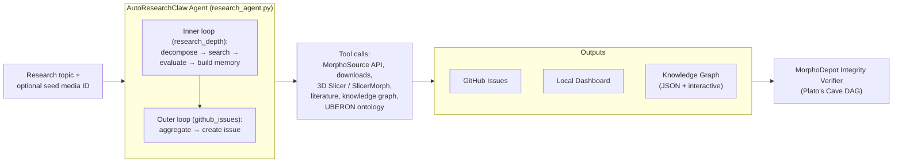

# AutoResearchClaw

[](LICENSE)
[](https://github.com/johntrue15/MorphoClaw/actions/workflows/tests.yml)
[](https://github.com/johntrue15/MorphoClaw/actions/workflows/code-quality.yml)
[](https://github.com/johntrue15/MorphoClaw/actions/workflows/docs.yml)
[](https://www.python.org/)

> An autonomous MorphoSource research agent inspired by [Karpathy's autoresearch](https://github.com/karpathy/autoresearch).
> Searches MorphoSource for 3D specimen data, runs headless 3D Slicer +
> SlicerMorph analyses, builds a live knowledge graph, and produces
> structured research reports as GitHub Issues — with an integrity verifier
> scoring every output.

## :sparkles: Full documentation

The full, professionally laid-out docs &mdash; with an **interactive
knowledge graph that updates automatically after every research run** &mdash;
live at:

**[johntrue15.github.io/MorphoClaw/](https://johntrue15.github.io/MorphoClaw/)**

Start there for:

- [**Quick Start**](https://johntrue15.github.io/MorphoClaw/quick-start/)
- [**Submit a Query**](https://johntrue15.github.io/MorphoClaw/query/)
- [**Live Knowledge Graph**](https://johntrue15.github.io/MorphoClaw/knowledge-graph/)
- [**Architecture**](https://johntrue15.github.io/MorphoClaw/architecture/)
- [**CLI / Workflows / Secrets reference**](https://johntrue15.github.io/MorphoClaw/reference/cli/)

## Architecture at a glance



Read the [full architecture write-up](https://johntrue15.github.io/MorphoClaw/architecture/)
for the two-loop engine, knowledge-graph schema, iterative segmentation flow,
and the integrity verifier's trust DAG.

## Quick start (TL;DR)

```bash
# Install
pip install -r requirements.txt
cp .env.example .env  # then fill in OPENAI_API_KEY and MORPHOSOURCE_API_KEY

# Run the agent
cd .github/scripts
python research_agent.py "Your research topic" \
  --research-depth 10 \
  --github-issues 1 \
  --media-list 000656244

# Local dashboard
python dashboard.py  # http://localhost:5001
```

Full CLI reference: <https://johntrue15.github.io/MorphoClaw/reference/cli/>.

## Trigger from GitHub Actions

1. **Actions** → **AutoResearchClaw Agent** → **Run workflow**.
2. Enter `research_topic`; optionally tune `research_depth`, `github_issues`,
   `media_id`, `media_list_id`, `openai_model`, `enable_nninteractive`, and
   `run_integrity_verifier`.
3. Results post to a tracking issue. The
   [live knowledge graph](https://johntrue15.github.io/MorphoClaw/knowledge-graph/)
   refreshes automatically after each run.

Full input matrix: <https://johntrue15.github.io/MorphoClaw/reference/workflows/>.

## Required secrets

- `OPENAI_API_KEY` &mdash; LLM calls (decompose, evaluate, synthesize).
- `MORPHOSOURCE_API_KEY` &mdash; specimen downloads.

Full secrets reference: <https://johntrue15.github.io/MorphoClaw/reference/secrets/>.

## Headline features

- **Two-loop research engine** &mdash; inner loop searches and evaluates;
  outer loop synthesises GitHub-issue reports. Memory accumulates between
  cycles.
- **3D Slicer + SlicerMorph integration** &mdash; headless morphometrics,
  PCA, landmarks, publication-grade screenshots.
- **Live knowledge graph** &mdash; auto-published JSON snapshot powers an
  interactive visualisation on the docs site.
- **nnInteractive paint loop** &mdash; LLM-driven iterative 3D
  segmentation with a comparison harness against curated MorphoSource GT.
- **Iterative self-training segmentation** &mdash; bootstraps a custom 3D
  U-Net student model on top of nnInteractive; graduates to autonomous
  operation when Dice clears threshold.
- **MorphoDepot integrity verifier** &mdash; Plato's-Cave trust DAG over
  every research run, with three release scores
  (`scientific_validity`, `ai_training_validity`,
  `commercial_release_validity`).
- **Issue automation** &mdash; submit research queries via a docs-site form
  that opens a pre-filled issue; an automation workflow processes and
  comments back with results.

Each of these is documented in depth on the
[**docs site**](https://johntrue15.github.io/MorphoClaw/).

## Project structure (short)

```text
.github/scripts/        # Agent + tools (research, slicer, nnInteractive, KG, verifier)
.github/workflows/      # GitHub Actions workflows (research, training, automation, docs)
metadata_to_morphsource/seg_train/  # Iterative-segmentation student-model pipeline
docs/                   # MkDocs Material docs site (deployed via .github/workflows/docs.yml)
  data/                 # Live KG snapshots committed by autoresearchclaw.yml
Tests/                  # pytest suite (unit / integration / live tiers)
```

Full tree with one-line descriptions per file:
<https://johntrue15.github.io/MorphoClaw/reference/project-structure/>.

## Self-hosted runner

The research pipeline runs on a self-hosted Mac mini with 3D Slicer 5.10
+ SlicerMorph, Anaconda Python 3.12, and a persistent specimen cache.

```bash
cd ~/actions-runner-morphosource
./config.sh --url https://github.com/USER/REPO --token TOKEN
./run.sh
```

## Local linting (matches CI)

```bash
black --line-length=100 .
ruff check --fix .
ruff check --select=E9,F63,F7,F82,F821,F823,B006,B008,B018 .
bandit -r . -c pyproject.toml --exclude ./Tests,./tests,./.venv,./venv,./data --severity-level high --confidence-level medium
yamllint .github/
```

See <https://johntrue15.github.io/MorphoClaw/reference/cli/>
for the full development workflow.

## Documentation

- **Docs site**: <https://johntrue15.github.io/MorphoClaw/>
- **Contributing**: [CONTRIBUTING.md](CONTRIBUTING.md)
- **Changelog**: [CHANGELOG.md](CHANGELOG.md)
- **Security**: [SECURITY.md](SECURITY.md)
- **Development**: [DEVELOPMENT.md](DEVELOPMENT.md)
- **Testing**: [TESTING.md](TESTING.md)

## References

- [karpathy/autoresearch](https://github.com/karpathy/autoresearch) &mdash; autonomous AI research experiments
- [MorphoSource](https://www.morphosource.org/) &mdash; 3D specimen data repository
- [3D Slicer](https://www.slicer.org/) &mdash; open-source medical image computing
- [SlicerMorph](https://slicermorph.github.io/) &mdash; 3D morphometrics for Slicer

## License

MIT &mdash; see [LICENSE](LICENSE).
