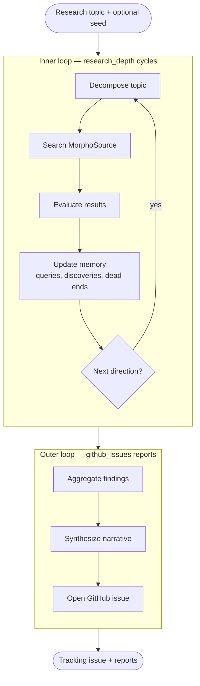
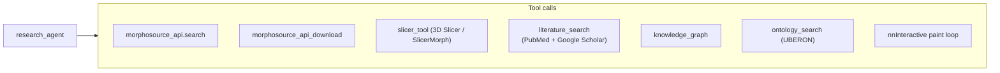
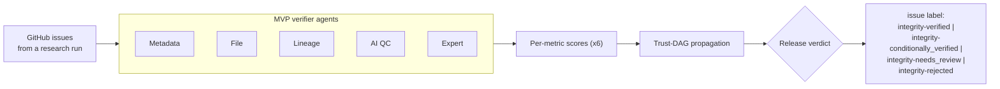

# Architecture

AutoResearchClaw is built around a **two-loop research engine** that drives a
small set of tool calls. Every loop iteration writes to a shared memory and
to the knowledge graph; every research issue feeds an independent integrity
verifier.

## The two-loop engine



- **Inner loop** runs `research_depth` fast cycles. Each cycle: decompose the
  topic into smaller MorphoSource queries, search the API, evaluate the
  results, and grow memory (`queries tried`, `discoveries`, `dead ends`,
  `next directions`).
- **Outer loop** posts cumulative findings as `github_issues` GitHub issue
  reports at regular intervals. Memory carries between cycles, so later
  reports build on what earlier ones found.

The reference implementation lives in
[`.github/scripts/research_agent.py`](https://github.com/johntrue15/Metadata-to-Morphsource-compare/blob/main/.github/scripts/research_agent.py).

## Tool calls



Every tool is a plain Python module under
[`.github/scripts/`](https://github.com/johntrue15/Metadata-to-Morphsource-compare/tree/main/.github/scripts).
They are imported directly by the agent and also exposed to the LLM as
OpenAI function-calling schemas (see `chat_handler.TOOLS`).

## The knowledge graph

The graph is built incrementally as records come back from MorphoSource. Each
record fans out into the canonical entities and relations:

```mermaid
flowchart LR
    Media -->|BELONGS_TO| Specimen
    Media -->|DERIVED_FROM| Media2[Media (parent)]
    Specimen -->|HELD_BY| Institution
    Specimen -->|IS_TAXON| Taxon
    Taxon -->|HAS_RANK| RankedTaxon[Taxon (GBIF rank)]
    Media -->|CITED_IN| Paper
    MediaList -->|CONTAINS| Media
```

See [`.github/scripts/knowledge_graph.py`](https://github.com/johntrue15/Metadata-to-Morphsource-compare/blob/main/.github/scripts/knowledge_graph.py)
for the implementation. The same module renders the per-run interactive HTML
attached to each workflow artifact. The
[**Live knowledge graph**](knowledge-graph.md) page on this site loads the
cumulative JSON published after every run.

## Iterative segmentation

```mermaid
flowchart LR
    Pairs["Open (CT, mesh) pairs<br/>from MorphoSource"] --> R0
    R0["Round 0: nnInteractive paint loop<br/>on every pair"] --> Seed["Seed dataset"]
    Seed --> Train0["Train Student v0"]
    Train0 --> RN

    subgraph RN["Round n &geq; 1"]
        direction TB
        Inf["Student inference"]
        Route["ConfidenceRouter:<br/>accept / correct / reject"]
        Refit["Retrain"]
        Inf --> Route --> Refit
    end

    RN -->|Dice &geq; threshold (x2)| Grad["Graduate:<br/>student runs autonomously"]
    Grad --> Ledger["ExperimentLedger<br/>(paper export)"]
```

Full methodology in [**Iterative Segmentation**](ITERATIVE_SEGMENTATION.md).

## Integrity verifier (Plato's Cave)

After every research run, the verifier builds a trust DAG over the GitHub
issues produced by the run. Five MVP agents score each issue across six
per-metric dimensions, scores propagate parent → child via a *trust gate*,
and the verifier emits three release scores:
`scientific_validity`, `ai_training_validity`, `commercial_release_validity`.



Read the full methodology, ontology, and calibration plan in
[**Integrity Verifier**](INTEGRITY_VERIFIER.md).

## Self-hosted execution

The heavy lifting (3D Slicer, nnInteractive, specimen cache) runs on a
self-hosted Mac mini runner. See [**Workflows**](reference/workflows.md) for
the matrix of jobs and which ones target `self-hosted` vs `ubuntu-latest`.
