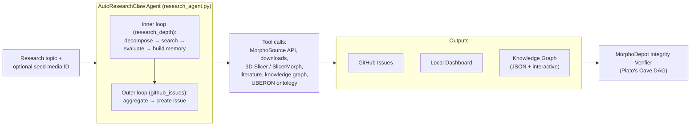

# AutoResearchClaw

  An autonomous MorphoSource research agent. It searches for 3D specimen data,
  runs headless 3D Slicer + SlicerMorph analyses, builds a live knowledge graph,
  and produces structured research reports as GitHub Issues &mdash; with an
  integrity verifier scoring every output.

[:material-rocket-launch: Quick Start](quick-start.md){ .arc-btn .arc-btn-primary }
[:material-graph-outline: Explore the Knowledge Graph](knowledge-graph.md){ .arc-btn .arc-btn-secondary }
[:material-message-question: Submit a Query](query.md){ .arc-btn .arc-btn-secondary }

## Knowledge Graph at a glance



  
{{ s.media }}

  
Media

  
{{ s.specimens }}

  
Specimens

  
{{ s.taxa }}

  
Taxa

  
{{ s.papers }}

  
Papers

  
{{ s.institutions }}

  
Institutions

  
{{ s.total_edges }}

  
Connections


:material-update: Last updated **{{ s.generated_at or "unknown" }}** across **{{ kg_run_count() }}** archived run(s).
[Open the live graph &rarr;](knowledge-graph.md)

!!! info "No knowledge graph data published yet"
    The graph is empty because no AutoResearchClaw run has published a snapshot
    to `docs/data/knowledge_graph.json` yet. Trigger the
    [**AutoResearchClaw Agent** workflow](https://github.com/johntrue15/Metadata-to-Morphsource-compare/actions/workflows/autoresearchclaw.yml)
    once and the graph will populate automatically on the next push.


## How it works

## What's inside

### :material-loop: Two-loop research engine
The inner loop runs fast cycles &mdash; decompose, search MorphoSource, evaluate,
remember. The outer loop posts cumulative findings as GitHub issues. Memory
carries between cycles. <a href="architecture/">Read more &rarr;</a>

### :material-rotate-3d-variant: 3D Slicer + SlicerMorph
Headless morphometric analysis pipeline: dimensions, surface area, volume,
curvature, PCA, landmarks, plus publication-grade screenshots from cached
specimens. <a href="reference/cli/">CLI &rarr;</a>

### :material-brain: nnInteractive paint loop
LLM-driven iterative segmentation that converges on the right mask in a
handful of clicks. Comparison harness validates against MorphoSource
ground-truth meshes. <a href="ITERATIVE_SEGMENTATION/">Methodology &rarr;</a>

### :material-graph: Live knowledge graph
Builds connections between media, specimens, papers, institutions, and
taxa. Auto-publishes a JSON snapshot after every run so this site stays
fresh. <a href="knowledge-graph/">Explore &rarr;</a>

### :material-shield-check: Integrity verifier
A Plato's-Cave trust DAG over each run's issues. Five MVP agents produce
six per-metric scores and a release-readiness verdict. <a href="INTEGRITY_VERIFIER/">Read more &rarr;</a>

### :material-school: Iterative self-training
Bootstraps a custom 3D student model from nnInteractive outputs, graduates
it to autonomous operation when Dice clears threshold, and logs every
event for paper export. <a href="ITERATIVE_SEGMENTATION/">Pipeline &rarr;</a>

## Get started in two minutes

1. Read the [**Quick Start**](quick-start.md) to submit your first query.
2. Skim the [**Architecture**](architecture.md) to understand the two-loop engine.
3. Watch the [**Knowledge Graph**](knowledge-graph.md) grow after each run.

## References

- [karpathy/autoresearch](https://github.com/karpathy/autoresearch) &mdash; the inspiration
- [MorphoSource](https://www.morphosource.org/) &mdash; 3D specimen data repository
- [3D Slicer](https://www.slicer.org/) &mdash; open-source medical image computing
- [SlicerMorph](https://slicermorph.github.io/) &mdash; 3D morphometrics for Slicer
