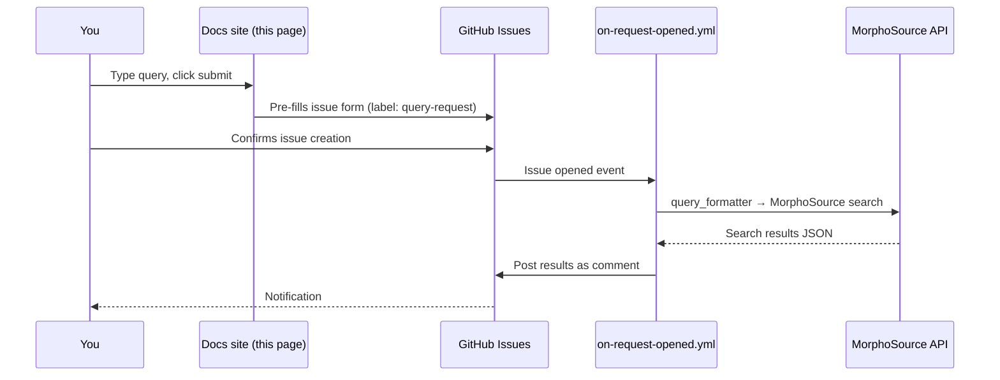

# Submit a Query

Type a natural-language question below. Clicking **Prepare to Submit Query**
creates a pre-filled GitHub issue with the `query-request` label; an automation
workflow picks it up, runs your search against MorphoSource, and posts results
back as a comment.

- :material-information-outline: **What you need** &mdash; a free GitHub account.

- :material-clock-fast: **Typical latency** &mdash; 1–2 minutes from issue creation to result comment.

- :material-shield-check: **Where results live** &mdash; on the issue you just created (you'll be subscribed for notifications).

<form id="queryForm" class="arc-query-form" autocomplete="off">
  <label for="queryText">Enter your query</label>
  <textarea id="queryText" name="query" placeholder="Example: Tell me about lizard specimens with CT scans..." required></textarea>

  

    <button type="submit" class="arc-btn arc-btn-primary" id="submitBtn">
      Prepare to Submit Query
    </button>
    <button type="button" class="arc-btn arc-btn-secondary" onclick="arcQueryClear()">
      Clear
    </button>
  

</form>

  <strong>Example queries (click to insert):</strong>
  <ul>
    <li onclick="arcQuerySet('Tell me about lizard specimens')">Tell me about lizard specimens</li>
    <li onclick="arcQuerySet('How many snake specimens are available?')">How many snake specimens are available?</li>
    <li onclick="arcQuerySet('Show me CT scans of crocodiles')">Show me CT scans of crocodiles</li>
    <li onclick="arcQuerySet('Compare cranial morphology across primate species')">Compare cranial morphology across primate species</li>
  </ul>

## How submission works under the hood

See the [Query System Guide](QUERY_SYSTEM_GUIDE.md) for the full pipeline, the
[Submission Guide](QUERY_SUBMISSION_GUIDE.md) for formatting tips, and the
[Issue Automation](ISSUE_AUTOMATION.md) docs for how labels and routing work.
