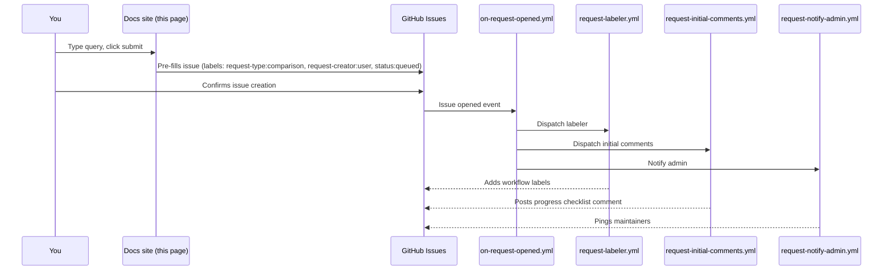

# Submit a Query

There are two ways to ask AutoResearchClaw a question. Both land in this repo
as a GitHub issue with the right labels so the automation actually runs.

<div class="grid cards" markdown>

-   :material-database-search: __Structured comparison request__

    ---

    Pick a comparison mode, paste a CSV/query, get a checklist comment back.
    This is the path that the existing workflows
    ([on-request-opened.yml](https://github.com/johntrue15/MorphoClaw/blob/main/.github/workflows/on-request-opened.yml),
    [verify-comparison.yml](https://github.com/johntrue15/MorphoClaw/blob/main/.github/workflows/verify-comparison.yml))
    are wired to handle.

    [:fontawesome-brands-github: Open the comparison-request form](https://github.com/johntrue15/MorphoClaw/issues/new?template=comparison_request.yml){ .md-button .md-button--primary }

-   :material-chat-question: __Free-text research query__

    ---

    Type a plain-English question; the docs site pre-fills an issue with the
    `request-type:comparison` and `request-creator:user` labels so the same
    automation kicks in.

    See the form below.

</div>

## Free-text submission

<div class="arc-query" markdown>

<form id="queryForm" class="arc-query-form" autocomplete="off">
  <label for="queryText">Enter your query</label>
  <textarea id="queryText" name="query" placeholder="Example: Tell me about lizard specimens with CT scans..." required></textarea>

  <div class="arc-query-buttons">
    <button type="submit" class="arc-btn arc-btn-primary" id="submitBtn">
      Prepare to Submit Query
    </button>
    <button type="button" class="arc-btn arc-btn-secondary" onclick="arcQueryClear()">
      Clear
    </button>
  </div>
</form>

<div class="arc-examples">
  <strong>Example queries (real research runs &mdash; click to insert, or view the knowledge graph it produced):</strong>
  <ul id="arcExampleList">
    <!-- Populated from arcExamples below so the "View graph" link stays in
         sync with whatever queries we expose. Each example is wired to a
         real snapshot in docs/data/runs/ via ?run=<file>. -->
  </ul>
</div>

<div id="status" class="arc-status" hidden></div>
<div id="workflowLink" class="arc-workflow" hidden></div>

</div>

<style>
.arc-query {
  background: var(--md-default-bg-color);
  border: 1px solid var(--md-default-fg-color--lightest);
  border-radius: 12px;
  padding: 1.5rem;
  margin: 1.5rem 0;
}
.arc-query-form label {
  display: block;
  font-weight: 600;
  margin-bottom: 0.5rem;
}
.arc-query-form textarea {
  width: 100%;
  min-height: 120px;
  padding: 0.85rem;
  border: 1px solid var(--md-default-fg-color--lightest);
  border-radius: 8px;
  background: var(--md-code-bg-color);
  color: var(--md-default-fg-color);
  font: inherit;
  resize: vertical;
}
.arc-query-form textarea:focus {
  outline: none;
  border-color: var(--md-primary-fg-color);
}
.arc-query-buttons {
  display: flex;
  gap: 0.75rem;
  margin-top: 1rem;
}
.arc-query-buttons .arc-btn {
  flex: 1;
}
.arc-examples {
  margin-top: 1.25rem;
  padding: 1rem;
  background: var(--md-code-bg-color);
  border-radius: 8px;
  font-size: 0.9rem;
}
.arc-examples ul {
  list-style: none;
  padding: 0;
  margin: 0.5rem 0 0 0;
}
.arc-examples li {
  display: flex;
  align-items: center;
  gap: 0.75rem;
  padding: 0.5rem 0.75rem;
  margin: 0.25rem 0;
  background: var(--md-default-bg-color);
  border: 1px solid var(--md-default-fg-color--lightest);
  border-radius: 6px;
  transition: border-color 0.15s ease;
}
.arc-examples li:hover {
  border-color: var(--md-primary-fg-color);
}
.arc-examples .arc-example-text {
  flex: 1;
  cursor: pointer;
}
.arc-examples .arc-example-graph {
  font-size: 0.85em;
  padding: 0.25rem 0.6rem;
  border-radius: 5px;
  background: var(--md-primary-fg-color);
  color: var(--md-primary-bg-color) !important;
  text-decoration: none;
  white-space: nowrap;
}
.arc-examples .arc-example-graph:hover {
  filter: brightness(1.1);
}
.arc-examples .arc-example-stats {
  font-size: 0.78em;
  color: var(--md-default-fg-color--light);
  margin-left: 0.25rem;
}
.arc-status {
  margin-top: 1rem;
  padding: 1rem;
  border-radius: 8px;
}
.arc-status.success { background: rgba(63, 185, 80, 0.12); border: 1px solid rgba(63, 185, 80, 0.4); color: var(--md-default-fg-color); }
.arc-status.error   { background: rgba(248, 81, 73, 0.12); border: 1px solid rgba(248, 81, 73, 0.4); color: var(--md-default-fg-color); }
.arc-workflow {
  margin-top: 1rem;
  padding: 1rem;
  background: var(--md-code-bg-color);
  border-radius: 8px;
}
.arc-workflow a {
  font-weight: 600;
}
</style>

<script>
(function () {
  const GITHUB_OWNER = "johntrue15";
  const GITHUB_REPO = "MorphoClaw";
  const NEW_ISSUE_URL = `https://github.com/${GITHUB_OWNER}/${GITHUB_REPO}/issues/new`;

  // Curated example queries. Each one is a *real* prompt that produced
  // a knowledge graph already committed under docs/data/runs/. The
  // `match` field is used to search the manifest entry; it can be the
  // exact filename (preferred) or a substring of the topic / local_run_id.
  const EXAMPLES = [
    {
      query: "Show me lizard data from Texas",
      match: "show_me_lizard_data_from_texas",
      blurb: "Squamate specimens & CT media from Texas collections",
    },
    {
      query: "Primate skull morphology comparative analysis across MorphoSource collections",
      match: "primate_skull_morphology",
      blurb: "Cross-collection cranial CT comparison",
    },
    {
      query: "Lets develop a follow up research paper to this one Primate Phenotypes A Multi-Institution Collection of 3D Morphological Data Housed in MorphoSource",
      match: "20260323_202413_lets_develop_a_follow_up_research_paper",
      blurb: "Follow-up to the Primate Phenotypes paper (refined run)",
    },
  ];

  function escapeAttr(s) {
    return String(s == null ? "" : s)
      .replace(/&/g, "&amp;")
      .replace(/"/g, "&quot;")
      .replace(/</g, "&lt;");
  }

  // The query page lives at <root>/query/, so the docs site root is one
  // directory up. We need to resolve the manifest against that root (not
  // against the current page) because docs/data/ ships at the site root.
  async function loadManifest() {
    try {
      const here = new URL(".", document.baseURI || window.location.href);
      const manifestUrl = new URL("../data/runs/_manifest.json", here).toString();
      const res = await fetch(manifestUrl, { cache: "no-store" });
      if (!res.ok) throw new Error(`HTTP ${res.status}`);
      return await res.json();
    } catch (err) {
      console.warn("[query] Could not load manifest:", err);
      return { runs: [] };
    }
  }

  function matchManifestEntry(manifest, needle) {
    if (!manifest || !Array.isArray(manifest.runs)) return null;
    const lowered = String(needle || "").toLowerCase();
    return (
      manifest.runs.find(
        (r) =>
          r.file === needle ||
          (r.topic && r.topic.toLowerCase().includes(lowered)) ||
          (r.local_run_id && r.local_run_id.toLowerCase().includes(lowered)) ||
          (r.run_id && r.run_id.toLowerCase().includes(lowered)),
      ) || null
    );
  }

  async function renderExamples() {
    const list = document.getElementById("arcExampleList");
    if (!list) return;
    const manifest = await loadManifest();
    const html = EXAMPLES.map((ex) => {
      const entry = matchManifestEntry(manifest, ex.match);
      const stats =
        entry && entry.stats
          ? `${entry.stats.total_nodes || 0} nodes &middot; ${entry.stats.total_edges || 0} edges`
          : "";
      const kgHref = entry
        ? `knowledge-graph/?run=${encodeURIComponent(entry.file)}`
        : "knowledge-graph/";
      const blurb = ex.blurb ? `<br/><small class="arc-example-stats">${escapeAttr(ex.blurb)}${stats ? " &middot; " + stats : ""}</small>` : (stats ? `<small class="arc-example-stats">${stats}</small>` : "");
      return (
        `<li>` +
          `<span class="arc-example-text" onclick="arcQuerySet(${JSON.stringify(ex.query)})">${escapeAttr(ex.query)}${blurb}</span>` +
          `<a class="arc-example-graph" href="../${kgHref}" title="Open the live knowledge graph for this query">View graph &rarr;</a>` +
        `</li>`
      );
    }).join("");
    list.innerHTML = html;
  }
  renderExamples();
  // These labels match what .github/workflows/on-request-opened.yml expects.
  // Without them the issue is created but no automation runs.
  const ISSUE_LABELS = [
    "request-type:comparison",
    "request-creator:user",
    "status:queued",
    "source:docs-site",
  ];

  const form = document.getElementById("queryForm");
  if (!form) return;
  const statusDiv = document.getElementById("status");
  const workflowLinkDiv = document.getElementById("workflowLink");
  const submitBtn = document.getElementById("submitBtn");

  form.addEventListener("submit", (e) => {
    e.preventDefault();
    const text = document.getElementById("queryText").value.trim();
    if (!text) return;

    submitBtn.disabled = true;
    submitBtn.textContent = "Preparing…";

    try {
      const title = `Comparison: ${text.substring(0, 60)}${text.length > 60 ? "…" : ""}`;
      // Body matches the field IDs the labeler / initial-comments workflows
      // look for in the structured template, so the automation can still
      // parse this free-text issue cleanly.
      const body = [
        "### Comparison / Verification Request",
        "",
        "**Comparison Mode**",
        "",
        "other (describe in Additional Context)",
        "",
        "**Input Source**",
        "",
        "morphosource-api",
        "",
        "**Description**",
        "",
        text,
        "",
        "**Query / Dataset**",
        "",
        "```",
        text,
        "```",
        "",
        "**Additional Context**",
        "",
        "Submitted via the AutoResearchClaw docs site (free-text path).",
      ].join("\n");

      const params = new URLSearchParams({
        title,
        body,
        labels: ISSUE_LABELS.join(","),
      });
      const issueUrl = `${NEW_ISSUE_URL}?${params.toString()}`;

      statusDiv.hidden = false;
      statusDiv.className = "arc-status success";
      statusDiv.innerHTML =
        "<strong>Ready to submit your query.</strong><br/>" +
        "Click the link below to open the pre-filled GitHub issue. " +
        "Clicking <em>Submit new issue</em> triggers the comparison-request automation.";

      workflowLinkDiv.hidden = false;
      workflowLinkDiv.innerHTML =
        `<a href="${issueUrl}" target="_blank" rel="noopener">Open the pre-filled GitHub issue &rarr;</a>` +
        `<br/><small>Prefer the structured form? <a href="https://github.com/${GITHUB_OWNER}/${GITHUB_REPO}/issues/new?template=comparison_request.yml" target="_blank" rel="noopener">Use the comparison-request template &rarr;</a></small>`;
    } catch (err) {
      statusDiv.hidden = false;
      statusDiv.className = "arc-status error";
      statusDiv.textContent = `Could not prepare submission: ${err.message}`;
    } finally {
      submitBtn.disabled = false;
      submitBtn.textContent = "Prepare to Submit Query";
    }
  });

  window.arcQuerySet = (text) => {
    document.getElementById("queryText").value = text;
  };
  window.arcQueryClear = () => {
    document.getElementById("queryText").value = "";
    statusDiv.hidden = true;
    workflowLinkDiv.hidden = true;
  };
})();
</script>

## How submission works under the hood



!!! tip "Why both labels matter"
    The handler at
    [`.github/workflows/on-request-opened.yml`](https://github.com/johntrue15/MorphoClaw/blob/main/.github/workflows/on-request-opened.yml)
    only fires when **both** `request-type:comparison` **and** `request-creator:user`
    are present on the issue. The docs form sets them automatically so the
    automation runs on every submission, not just on issues opened via the
    structured template.

See the [Query System Guide](QUERY_SYSTEM_GUIDE.md) for the full pipeline, the
[Submission Guide](QUERY_SUBMISSION_GUIDE.md) for formatting tips, and the
[Issue Automation](ISSUE_AUTOMATION.md) docs for how labels and routing work.
