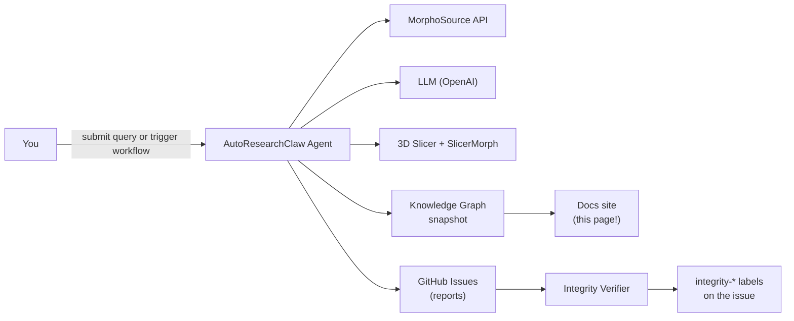

# Quick Start

This page walks through the **two** common ways to use AutoResearchClaw:

1. **Submit a query** &mdash; for end users who just want answers about MorphoSource specimens.
2. **Trigger the agent** &mdash; for maintainers running the full autonomous research workflow.

## :material-flash: Submit a query in 30 seconds

[:material-cursor-default-click: Open the Submit-a-Query page](query.md){ .md-button .md-button--primary }
[:material-github: Or create an issue directly](https://github.com/johntrue15/Metadata-to-Morphsource-compare/issues/new?labels=query-request&title=Query%3A){ .md-button }

Behind the scenes, the form opens a pre-populated **GitHub issue**. A workflow
([on-request-opened.yml](https://github.com/johntrue15/Metadata-to-Morphsource-compare/blob/main/.github/workflows/on-request-opened.yml))
picks up the issue, formats your natural-language question into a MorphoSource
API URL, runs the search, and posts results back as a comment.

!!! tip "What you need"
    A free GitHub account and a clear question. Example prompts:

    - *Tell me about lizard specimens with CT scans*
    - *How many snake specimens are available?*
    - *Show me CT scans of crocodiles*

For the full submission protocol, see the
[**Submission Guide**](QUERY_SUBMISSION_GUIDE.md).

## :material-rocket: Run the full research agent

The agent runs on the self-hosted Mac mini runner. From the GitHub UI:

1. Go to **Actions** → **AutoResearchClaw Agent** → **Run workflow**.
2. Enter a `research_topic`.
3. (Optional) Set `research_depth` (internal cycles) and `github_issues` (reports).
4. (Optional) Provide a `media_id` or `media_list_id` from MorphoSource to seed the run.

Results post automatically to a tracking issue. Reports, logs, and the
knowledge-graph JSON / HTML are uploaded as workflow artifacts, and the
docs site refreshes with the new snapshot on the next commit.

| Input | Default | Description |
|-------|---------|-------------|
| `research_topic` | (required) | Research goal or question |
| `research_depth` | `10` | Internal research cycles |
| `github_issues` | `3` | GitHub issue reports to create |
| `media_id` | &mdash; | Seed MorphoSource media ID (e.g. `000769445`) |
| `media_list_id` | &mdash; | Batch seed via a MorphoSource media list ID |
| `openai_model` | `gpt-5.4` | LLM used for decomposition / evaluation |
| `run_integrity_verifier` | `true` | Run the Plato's-Cave verifier afterward |

See the full input reference in the
[**Workflows**](reference/workflows.md) page.

## :material-laptop: Run it locally

```bash
# Install dependencies
pip install -r requirements.txt

# Configure API keys
cp .env.example .env  # then edit values

# Run the agent
cd .github/scripts
python research_agent.py "Your research topic" \
  --research-depth 10 \
  --github-issues 1 \
  --media-list 000656244

# Start the local dashboard
python dashboard.py  # http://localhost:5001
```

Required secrets:

- `OPENAI_API_KEY` &mdash; LLM calls (decompose, evaluate, synthesize).
- `MORPHOSOURCE_API_KEY` &mdash; specimen downloads.

See [**Secrets & Env**](reference/secrets.md) for the full list.

## :material-progress-check: What happens next



## Next steps

- Explore the [**Live Knowledge Graph**](knowledge-graph.md) of everything the agent has discovered.
- Read the [**Architecture**](architecture.md) to understand the two-loop engine.
- Browse the [**Workflows reference**](reference/workflows.md) for every CI surface.
